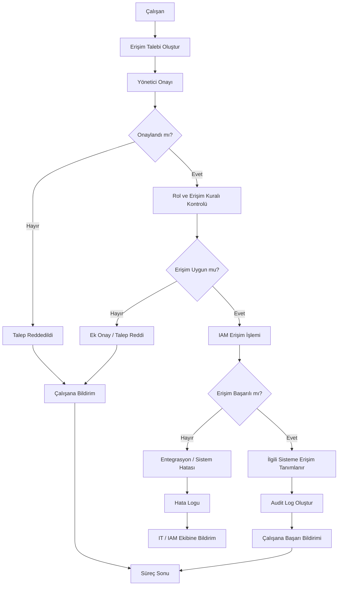
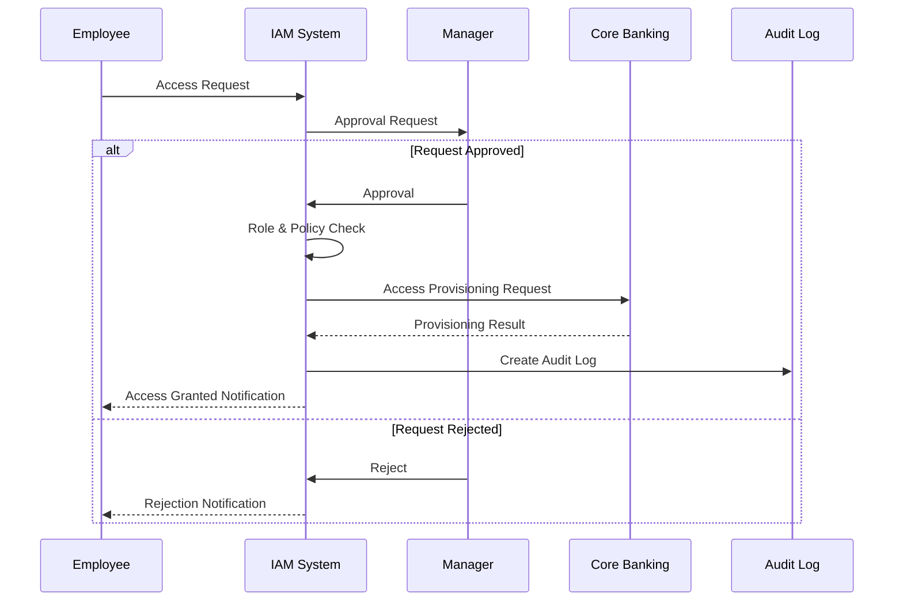

# Process Flow

## 1. Amaç

Bu dokümanda, çalışan erişim yönetimi için tasarlanan TO-BE sürecinin süreç akışı gösterilmektedir.

Akış içerisinde:

* Erişim talebinin oluşturulması
* Yönetici onayı
* Rol ve erişim kontrolü
* IAM işlemi
* İlgili sistemle entegrasyon
* Audit log
* Kullanıcı bildirimi

adımları ele alınmıştır.

---

## 2. TO-BE Process Flow



---

## 3. Süreçteki Karar Noktaları

### 3.1. Yönetici Onayı

İlk karar noktası yöneticinin talebi onaylayıp onaylamadığıdır.

```text
Talep
  ↓
Yönetici Onayı
  ↓
Onaylandı mı?
 ├── Hayır → Talep reddedilir
 └── Evet → Sonraki adıma geçilir
```

---

### 3.2. Rol ve Erişim Uygunluğu

Yönetici onayından sonra talep edilen erişimin çalışanın rolüyle uyumlu olup olmadığı kontrol edilir.

```text
Rol Kontrolü
     ↓
Erişim uygun mu?
 ├── Hayır → Ek onay / Red
 └── Evet → IAM işlemi
```

Bu kontrol, rol bazlı erişim yönetiminin temel noktalarından biridir.

---

### 3.3. Erişim İşleminin Başarılı Olması

IAM üzerinden erişim tanımlama işlemi gerçekleştirildikten sonra işlemin başarılı olup olmadığı kontrol edilir.

```text
IAM İşlemi
    ↓
Başarılı mı?
 ├── Hayır → Hata logu + IT/IAM bildirimi
 └── Evet → Erişim tanımlama + Audit Log
```

---

## 4. Sistemler Arası Akış

TO-BE süreçte temel sistem etkileşimi aşağıdaki şekilde düşünülebilir:



---

## 5. Başarılı ve Başarısız Akışlar

### Başarılı Akış

```text
Erişim Talebi
     ↓
Yönetici Onayı
     ↓
Rol Kontrolü
     ↓
IAM
     ↓
Core Banking
     ↓
Erişim Tanımlandı
     ↓
Audit Log
     ↓
Bildirim
```

### Başarısız Akış – Yönetici Reddi

```text
Erişim Talebi
     ↓
Yönetici Onayı
     ↓
RED
     ↓
Çalışana Bildirim
```

### Başarısız Akış – Rol Uyumsuzluğu

```text
Erişim Talebi
     ↓
Yönetici Onayı
     ↓
Rol Kontrolü
     ↓
Uygun Değil
     ↓
Ek Onay / Red
```

### Başarısız Akış – Teknik Hata

```text
Erişim Talebi
     ↓
IAM
     ↓
Core Banking
     ↓
Entegrasyon Hatası
     ↓
Hata Logu
     ↓
IT / IAM Ekibine Bildirim
```

---

## 6. BA Perspektifinden Süreç Akışı

Bir Business Analyst olarak süreç akışını hazırlarken yalnızca "hangi adım hangi adımdan sonra geliyor?" sorusuna bakılmaz.

Aşağıdaki noktalar da değerlendirilir:

* Süreci kim başlatıyor?
* Hangi sistem kullanılıyor?
* Hangi noktada karar veriliyor?
* Kararı kim veriyor?
* Hangi durumda süreç sonlanıyor?
* Hangi durumda süreç başka bir ekibe aktarılıyor?
* Başarılı işlem nasıl takip ediliyor?
* Hata oluştuğunda ne oluyor?
* Hangi bilgiler loglanıyor?
* Kullanıcıya hangi noktada bilgi veriliyor?

Bu sorular daha sonra requirements, user stories, acceptance criteria ve test senaryolarının oluşturulmasına yardımcı olur.

---

## 7. Süreçten Requirements'a Geçiş Örneği

Süreç akışındaki bir adım daha sonra functional requirement haline getirilebilir.

### Süreç Adımı

> Çalışan erişim talebi oluşturur.

### Functional Requirement

> Sistem, çalışanın erişmek istediği sistem ve rol bilgilerini içeren bir erişim talebi oluşturmasına izin vermelidir.

### User Story

> Bir çalışan olarak, görevimi yerine getirebilmek için ihtiyaç duyduğum sistem erişimi için talep oluşturmak istiyorum.

### Acceptance Criteria

```text
Given çalışan erişim talep ekranındadır
When gerekli bilgileri girip talebi gönderir
Then sistem erişim talebini oluşturmalıdır.
```

Bu bağlantı, süreç analizinden gereksinim analizine geçişin temel örneklerinden biridir.

---

## 8. Süreç Özeti

```text
AS-IS
  ↓
Mevcut problemler
  ↓
TO-BE
  ↓
Process Flow
  ↓
Functional Requirements
  ↓
User Stories
  ↓
Acceptance Criteria
  ↓
Testing / UAT
```

Bu proje kapsamında süreç akışı, sonraki analiz çalışmalarında oluşturulacak gereksinimlerin temel girdilerinden biri olarak kullanılacaktır.
