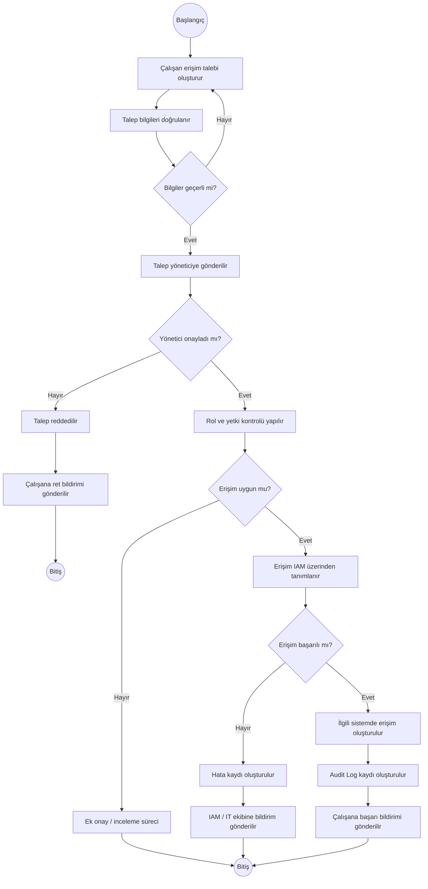

# Activity Diagram

## 1. Kısaca Activity Diagram;

Activity Diagram, bir iş sürecinin veya sistem işleminin **adım adım nasıl ilerlediğini** gösterir.

Business Analyst açısından özellikle şu durumlarda kullanılır:

* Sürecin başlangıç ve bitişini göstermek
* İş adımlarını sıralamak
* Karar noktalarını göstermek
* Alternatif ve hata akışlarını göstermek
* Manuel ve sistem tarafından yapılan işlemleri ayırmak
* Karmaşık süreçleri görselleştirmek

Bu projede Activity Diagram ile çalışan tarafından oluşturulan erişim talebinin **onaylanmasından erişimin tanımlanmasına kadar olan süreç** modellenmiştir.

---

## 2. Sürecin Ana Akışı

Temel süreç:

**Erişim Talebi → Yönetici Onayı → Rol/Yetki Kontrolü → IAM → İlgili Sistem → Audit Log → Bildirim**

Ancak her işlem her zaman başarılı olmayabilir.

Örneğin:

* Yönetici talebi reddedebilir.
* Talep edilen erişim çalışanın rolüne uygun olmayabilir.
* IAM erişimi tanımlarken hata oluşabilir.

Activity Diagram bu karar noktalarını da gösterir.

---

## 3. Activity Diagram



---

## 4. Akışın Açıklaması

### 1. Erişim talebi oluşturulur

Çalışan ihtiyaç duyduğu sistem, rol, erişim seviyesi ve gerekçe bilgilerini girerek talep oluşturur.

Örneğin:

> Sistem: Core Banking
> Rol: Credit Operations User
> Erişim Seviyesi: Transaction
> Gerekçe: Kredi operasyon işlemlerinin yürütülmesi

---

### 2. Bilgiler doğrulanır

Sistem talepteki zorunlu alanları kontrol eder.

Örneğin:

* Sistem seçilmiş mi?
* Rol seçilmiş mi?
* Erişim seviyesi seçilmiş mi?
* Gerekçe girilmiş mi?

Bilgiler eksikse talep devam etmez.

---

### 3. Yönetici onayı

Talep yöneticinin ekranına düşer.

Yönetici:

* **Onaylayabilir**
* **Reddedebilir**

Reddedilirse süreç sonlanır ve çalışana bildirim gönderilir.

---

### 4. Rol ve yetki kontrolü

Talep onaylandıktan sonra erişimin çalışanın rolüne uygunluğu kontrol edilir.

Örneğin:

> Çalışanın rolü: Kredi Operasyon Uzmanı
> Talep edilen erişim: Kredi İşlemleri

Bu erişim rol ile uyumluysa süreç devam eder.

Uyumsuzsa ek inceleme veya farklı bir onay süreci gerekebilir.

---

### 5. IAM üzerinden erişim tanımlama

Uygun bulunan talep IAM sistemine iletilir.

IAM gerekli erişimi ilgili sisteme tanımlamaya çalışır.

Bu aşamada teknik bir hata oluşabilir.

Örneğin:

> Core Banking sistemi erişim isteğine cevap vermedi.

Bu durumda hata kaydı oluşturulur ve ilgili IT/IAM ekibine bildirim gönderilir.

---

### 6. Audit Log

Erişim başarılı şekilde oluşturulduğunda işlem kayıt altına alınır.

Örneğin:

```text
Employee: EMP001
System: CORE_BANKING
Role: CREDIT_OPERATIONS_USER
Action: ACCESS_GRANTED
Date: 2026-09-19
Status: SUCCESS
```

Bu kayıt daha sonra denetim ve takip amacıyla kullanılabilir.

---

### 7. Kullanıcıya bildirim

Son olarak çalışana işlemin sonucu bildirilir.

Örneğin:

> "Core Banking erişim talebiniz onaylanmış ve erişiminiz tanımlanmıştır."

---

## 5. Activity Diagram'da Dikkat Edilen Noktalar

* Süreç nerede başlıyor?
* Nerede bitiyor?
* Hangi adımlar sıralı ilerliyor?
* Karar noktaları nerede?
* Hangi durumda süreç farklı bir yola giriyor?
* Hata oluşursa ne oluyor?
* Kim hangi adımı gerçekleştiriyor?
* Başka bir sistem sürece dahil oluyor mu?

---

## 6. Business Analyst Açısından Önemi

Activity Diagram, iş biriminden gelen süreci geliştirici ve test ekiplerinin daha kolay anlayabileceği şekilde görselleştirmeye yardımcı olur.

Örneğin iş birimi:

> "Çalışan erişim talebi açıyor, yönetici onaylıyor ve sonra erişim veriliyor."

diyebilir.

BA bunu daha detaylı bir sürece dönüştürür:

> Talep oluştur → Validasyon → Yönetici onayı → Rol kontrolü → IAM → İlgili sistem → Audit Log → Bildirim

Böylece eksik veya belirsiz noktalar daha kolay ortaya çıkar.

Örneğin BA şu soruyu fark edebilir:

> "Yönetici reddederse çalışana bildirim gidiyor mu?"

Bu soru iş kuralının netleştirilmesini sağlar ve daha sonra requirement, user story ve test case'e dönüşebilir.

---

## 7. Activity Diagram → Requirement İlişkisi

Örneğin Activity Diagram'daki:

**"Bilgiler geçerli mi?"**

kararından şu gereksinim üretilebilir:

**FR-009 – Talep Validasyonu**

> Sistem, erişim talebi gönderilmeden önce zorunlu alanların doldurulup doldurulmadığını kontrol etmelidir.

Bunun ardından:

**FR → User Story → Acceptance Criteria → Test Case → UAT**

zinciri oluşturulabilir.

Bu nedenle Activity Diagram sadece görsel bir çalışma değil, diğer analiz dokümanlarının oluşturulmasına da destek olur.
