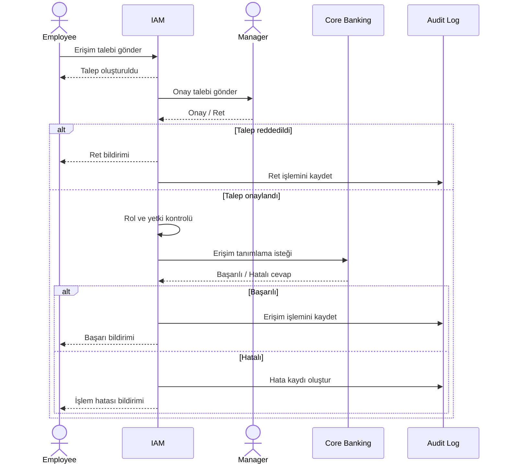

# Sequence Diagram

## 1. Kısaca Sequence Diagram;

Sequence Diagram, bir işlem sırasında **aktörlerin ve sistemlerin birbirleriyle hangi sırayla iletişim kurduğunu** gösterir.

Business Analyst açısından şu soruların cevaplanmasına yardımcı olur:

* Hangi sistem iletişimi başlatıyor?
* Hangi sistem hangi sisteme veri gönderiyor?
* Hangi sırayla işlem gerçekleşiyor?
* Sistem hangi cevabı dönüyor?
* Hata oluşursa ne oluyor?

Bu projede Employee, IAM, Manager, Core Banking ve Audit Log arasındaki iletişim modellenmiştir.

---

## 2. Erişim Talebi Sequence Diagramı



---

## 3. Akışın Açıklaması

### 1. Çalışan → IAM

Çalışan erişim talebini oluşturur.

Örneğin:

```text
System: Core Banking
Role: Credit Operations User
Access Level: Transaction
Reason: Kredi operasyon işlemleri
```

IAM talebi oluşturur ve takip edilebilir bir talep numarası üretir.

---

### 2. IAM → Manager

IAM, talebi ilgili yöneticinin onayına gönderir.

Yönetici:

* Onaylar
* Reddeder

Reddedilirse:

**IAM → Employee:** Ret bildirimi

Ayrıca işlem Audit Log'a kaydedilir.

---

### 3. IAM → Role & Policy Check

Talep onaylandıktan sonra IAM tarafında rol ve yetki kontrolü yapılır.

Örneğin:

```text
Employee Role:
Credit Operations Specialist

Requested Access:
Credit Operations / Transaction

Result:
Compatible
```

Bu kontrolün amacı çalışanın ihtiyaç duyduğu erişim seviyesinin belirlenen kurallara uygun olup olmadığını kontrol etmektir.

---

### 4. IAM → Core Banking

Kontrol başarılı olduğunda IAM, Core Banking sistemine erişim tanımlama isteği gönderir.

Basitleştirilmiş olarak:

```text
IAM
 |
 | Access Request
 v
Core Banking
 |
 | Response
 v
IAM
```

Bu iletişim bir **REST API** veya sistemin desteklediği durumlarda **SOAP API** üzerinden gerçekleştirilebilir.

BA burada API'nin kodunu yazmak zorunda değildir.

BA'nın anlaması gereken temel noktalar:

* Hangi sistem iletişim kuruyor?
* Hangi veri gönderiliyor?
* Hangi format kullanılıyor?
* Başarılı cevap nasıl?
* Hata cevabı nasıl?
* Hata durumunda süreç ne yapacak?

---

## 5. Örnek Request / Response

### Request

IAM tarafından Core Banking'e gönderilen örnek veri:

```json
{
  "employeeId": "EMP001",
  "system": "CORE_BANKING",
  "role": "CREDIT_OPERATIONS_USER",
  "accessLevel": "TRANSACTION"
}
```

### Başarılı Response

```json
{
  "requestId": "IAM-1001",
  "status": "SUCCESS"
}
```

### Hatalı Response

```json
{
  "requestId": "IAM-1001",
  "status": "ERROR",
  "errorCode": "CB-403",
  "message": "Access could not be created"
}
```

Buradaki amaç gerçek bir bankacılık API'si oluşturmak değil, BA olarak **sistemler arası veri alışverişinin mantığını anlamaktır.**

---

## 6. Audit Log

İşlem başarılı veya başarısız olduğunda önemli olaylar kayıt altına alınır.

Örneğin:

```text
Request ID: IAM-1001
Employee: EMP001
System: CORE_BANKING
Action: ACCESS_GRANTED
Status: SUCCESS
Timestamp: 2026-09-19 14:30
```

Hata durumunda:

```text
Request ID: IAM-1001
Action: ACCESS_PROVISION
Status: ERROR
Error Code: CB-403
```

Bu kayıtlar daha sonra operasyon, güvenlik ve denetim ekipleri tarafından incelenebilir.

---

## 7. BA Açısından Sequence Diagram

BA'nın burada özellikle netleştirmesi gereken noktalar:

| Konu            | BA'nın Sorusu                         |
| --------------- | ------------------------------------- |
| Sistemler       | Hangi sistemler iletişim kuruyor?     |
| Başlatan sistem | İsteği kim gönderiyor?                |
| Veri            | Hangi bilgiler gönderiliyor?          |
| Format          | JSON mi, XML mi?                      |
| API             | REST mi, SOAP mı?                     |
| Response        | Başarılı cevap nasıl anlaşılacak?     |
| Error           | Hangi hatalar oluşabilir?             |
| Timeout         | Sistem cevap vermezse ne olacak?      |
| Logging         | İşlem nerede kayıt altına alınacak?   |
| Notification    | Kullanıcı ne zaman bilgilendirilecek? |

---

## 8. Sequence Diagram → Requirement

Sequence Diagram'daki bir iletişim requirement'a dönüştürülebilir.

Örneğin:

**Sequence:**

> IAM → Core Banking: Erişim tanımlama isteği

Bunun karşılığı:

**TR-001 – Sistem Entegrasyonu**

> IAM sistemi, onaylanan erişim taleplerini ilgili sistemlere iletebilmelidir.

Başka bir örnek:

**Sequence:**

> Core Banking → IAM: Hatalı response

Bunun karşılığı:

**TR-006 – Integration Error Handling**

> Sistem, entegrasyon sırasında oluşan hataları yakalamalı ve ilgili hata bilgisini kayıt altına almalıdır.

---

## 9. Use Case → Activity → Sequence

Üç UML çalışmasını birlikte düşündüğümüzde:

### Use Case

**Employee → Erişim Talebi Oluştur**

Kim, ne yapıyor?

↓

### Activity Diagram

**Talep → Validasyon → Yönetici Onayı → Rol Kontrolü → IAM → Core Banking → Audit Log**

Süreç nasıl ilerliyor?

↓

### Sequence Diagram

**Employee → IAM → Manager → IAM → Core Banking → IAM → Audit Log**

Sistemler hangi sırayla iletişim kuruyor?

Bu üç model aynı iş sürecini farklı açılardan açıklar.

---

## 10. Business Analyst'in Buradaki Rolü

BA'nın görevi sistemlerin teknik implementasyonunu yapmak değildir.

BA'nın görevi;

* İş ihtiyacını anlamak,
* Süreci modellemek,
* Sistemler arasındaki etkileşimleri belirlemek,
* Gönderilecek verileri tanımlamak,
* Beklenen response'ları anlamak,
* Hata senaryolarını belirlemek,
* Gereksinimleri dokümante etmek

ve bunları geliştirme ve test ekiplerinin kullanabileceği şekilde aktarmaktır.

Bu nedenle Sequence Diagram, **iş ihtiyacından teknik gereksinime geçişte önemli bir köprü** görevi görür.
