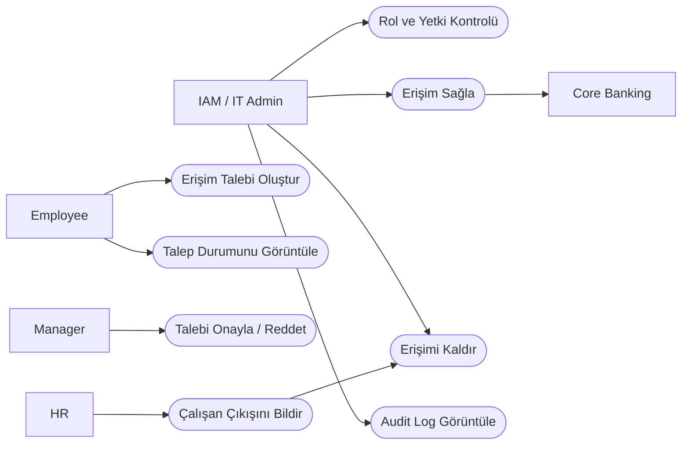

# Use Case Analysis

## 1. Kısaca UML;

UML (Unified Modeling Language), bir sistemin yapısını ve davranışını görsel olarak modellemek için kullanılan standart bir modelleme dilidir.

Business Analyst açısından UML; iş ihtiyaçlarının, sistem davranışlarının ve aktörler arasındaki ilişkilerin daha anlaşılır şekilde ifade edilmesini sağlar.

Bu projede üç temel UML diyagramı kullanılacaktır:

* **Use Case Diagram:** Kim, sistemde hangi işlemi yapıyor?
* **Activity Diagram:** İşlem hangi adımlardan geçiyor?
* **Sequence Diagram:** Sistemler hangi sırayla iletişim kuruyor?

---

## 2. Kısaca Use Case;

Use Case, bir aktörün sistem üzerinden gerçekleştirdiği işlemi ve bu işlemden beklediği amacı tanımlar.

Temel yapı:

**Actor → Use Case**

Örneğin:

**Employee → Create Access Request**

Bu ifade, çalışanın sistem üzerinden erişim talebi oluşturduğunu gösterir.

Use Case'in temel amacı sistemdeki kullanıcıları ve gerçekleştirdikleri temel işlemleri belirlemektir.

---

## 3. Aktörler

| Aktör          | Rolü                                                                   |
| -------------- | ---------------------------------------------------------------------- |
| Employee       | Erişim talebi oluşturur ve talep durumunu takip eder.                  |
| Manager        | Erişim taleplerini inceler, onaylar veya reddeder.                     |
| IAM / IT Admin | Rol ve yetki kontrollerini gerçekleştirir, erişim verir veya kaldırır. |
| HR             | Çalışanın işe giriş/çıkış bilgilerini sürece aktarır.                  |
| Core Banking   | Onaylanan erişim bilgisinin iletildiği dış sistemdir.                  |

---

## 4. Use Case'ler

| ID     | Use Case                   | Aktör          | Açıklama                                                               |
| ------ | -------------------------- | -------------- | ---------------------------------------------------------------------- |
| UC-001 | Erişim Talebi Oluşturma    | Employee       | Çalışan ihtiyaç duyduğu sistem ve rol için erişim talebi oluşturur.    |
| UC-002 | Talep Durumunu Görüntüleme | Employee       | Çalışan talebinin mevcut durumunu görüntüler.                          |
| UC-003 | Talebi Onaylama/Reddetme   | Manager        | Yönetici erişim talebini değerlendirir.                                |
| UC-004 | Rol ve Yetki Kontrolü      | IAM / IT Admin | Talep edilen erişimin çalışanın rolüne uygunluğu kontrol edilir.       |
| UC-005 | Erişim Sağlama             | IAM / IT Admin | Onaylanan erişim ilgili sisteme tanımlanır.                            |
| UC-006 | Erişimi Kaldırma           | IAM / IT Admin | Artık ihtiyaç duyulmayan erişim kaldırılır.                            |
| UC-007 | Audit Log Görüntüleme      | IAM / IT Admin | Erişim işlemlerine ait kayıtlar incelenir.                             |
| UC-008 | Çalışan Çıkışını Bildirme  | HR             | Çalışanın işten ayrılması durumunda erişim kaldırma süreci başlatılır. |

---

## 5. Use Case İlişkisi

Temel erişim süreci şu şekilde modellenebilir:

> Not: Bu gösterim, GitHub üzerinde kolay görüntülenebilmesi için Mermaid `flowchart` kullanılarak hazırlanmıştır. Mantıksal olarak Use Case modelini temsil eder.

---

## 6. Örnek Use Case

### UC-001 – Erişim Talebi Oluşturma

**Aktör:** Employee

**Amaç:**
Çalışanın ihtiyaç duyduğu sistem ve erişim seviyesi için talep oluşturabilmesi.

**Ön koşul:**

* Çalışan sisteme giriş yapmış olmalıdır.

**Ana akış:**

1. Çalışan erişim talebi ekranını açar.
2. İlgili sistemi seçer.
3. Rolü seçer.
4. Erişim seviyesini seçer.
5. Talep nedenini girer.
6. Talebi gönderir.
7. Sistem talebi oluşturur.
8. Talep yönetici onayına gönderilir.

**Alternatif durum:**

* Zorunlu alanlardan biri boşsa sistem talebi oluşturmaz.
* Kullanıcının yetkili olmadığı bir erişim seçilirse sistem uyarı verir.

**Beklenen sonuç:**

Erişim talebi oluşturulur ve takip edilebilir bir talep numarası/status bilgisi oluşur.

---

## 7. Business Analyst Açısından Use Case

* Bu işlemi kim yapacak?
* Kullanıcının amacı ne?
* İşlem başlamadan önce hangi koşullar gerekli?
* İşlem sırasında hangi adımlar gerçekleşiyor?
* Hangi durumda işlem başarısız olabilir?
* İşlem tamamlandığında ne olması gerekiyor?
* Başka bir sistem bu sürece dahil mi?

Örneğin:

> **İhtiyaç:** Çalışan Core Banking sistemine erişmek istiyor.

BA bunu doğrudan "erişim verilsin" şeklinde bırakmaz.

Şu sorularla detaylandırır:

**Kim?**
Employee

**Hangi sistem?**
Core Banking

**Hangi rol?**
Credit Operations User

**Hangi erişim seviyesi?**
Transaction

**Kim onaylayacak?**
Manager

**Yetki uygunluğu nasıl kontrol edilecek?**
IAM / Role & Policy Check

**Erişim nasıl tanımlanacak?**
IAM üzerinden ilgili sisteme iletilecek.

Böylece basit bir iş ihtiyacı, analiz edilebilir bir sistem davranışına dönüşür.

---

## 8. Use Case → Diğer Analizler

Use Case'ten sonraki analizlerde aynı süreci daha detaylı inceleyeceğiz:

**Use Case**

> Employee → Erişim Talebi Oluştur

↓

**Activity Diagram**

> Talep oluştur → Alanları doldur → Doğrula → Talebi gönder → Yöneticiye ilet

↓

**Sequence Diagram**

> Employee → IAM → Manager → IAM → Core Banking

Bu nedenle üç diyagram birbirinin alternatifi değil, **aynı sürecin farklı yönlerini gösteren tamamlayıcı analizlerdir.**
